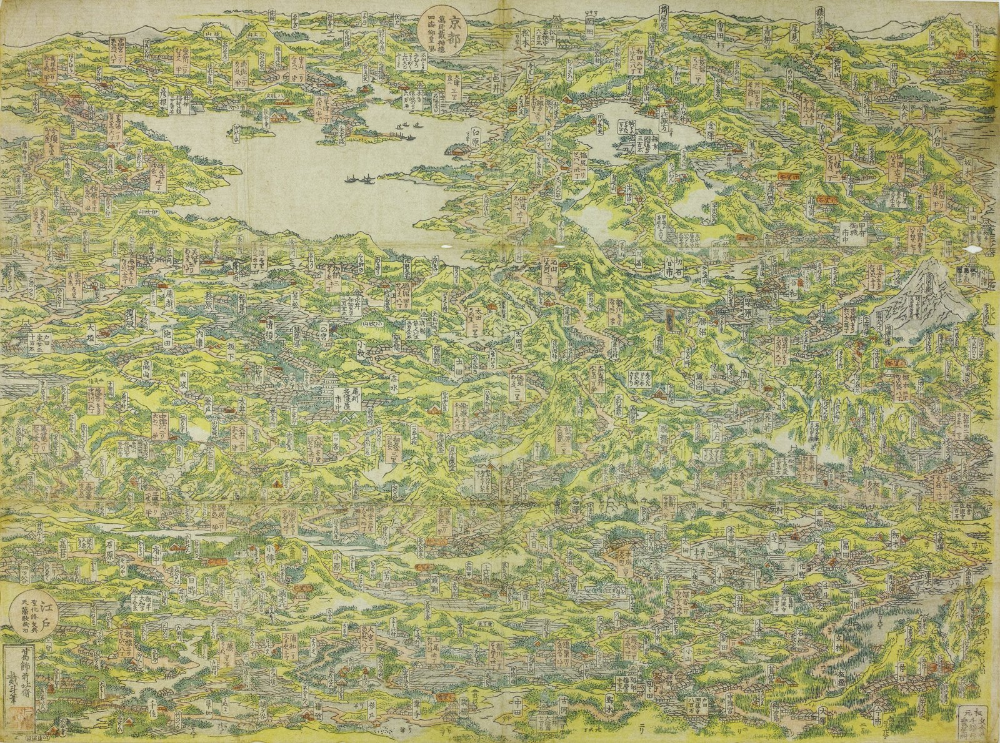

# Nakasendō Pixel — 中山道・木曽街道六十九次

[Tōkaidō Pixel](https://github.com/SIMPLYBOYS/tokaido-pixel) 的山線姊妹作。同一套公式：北斎鳥瞰圖當 overworld，每站進到浮世繪真跡裡找細節。

**線上直接玩 → [simplyboys.github.io/nakasendo-pixel](https://simplyboys.github.io/nakasendo-pixel/)**

| | 東海道（本線） | 中山道（本作） |
|---|---|---|
| Overworld | 北斎《東海道名所一覧》1818 | 北斎《木曽路名所一覧》1819（翌年姊妹作） |
| 宿場系列 | 広重《東海道五十三次》保永堂版 | 渓斎英泉 24 + 広重 47 =《木曽海道六拾九次之内》71 幅 / 70 編號 |
| 站數 | 53+2 | 69+1 |
| 招牌事件 | 川止め（大川渡涉） | 峠越え・大雪（中山道當年正是為了避開渡河才被選走） |

**畫作**全部 public domain（英泉歿 1848、広重歿 1858、北斎歿 1849）。**但掃描不是**——
北斎鳥瞰圖的掃描是 CC BY-ND，草津・大津的掃描 MFA 主張著作權。畫是自由的，拍畫的人未必這麼想；
逐幅的權利狀態記在 [`data/stations.json`](data/stations.json) 的 `rights_note` 欄，遊戲裡也有「出典」。

## 現況：全程可玩，日本橋 → 大津 70 站

兩個未驗證風險都拆掉了 →  **[完整報告](docs/phase0-asset-survey.md)**

- **Overworld**（第一風險）：北斎《木曽路名所一覧》**7898×5873** 可取得，比東海道的 overworld（2500px）還高。Commons 上沒有，唯一來源是神戸市立博物館的 IIIF（授權 CC BY-ND —— 原樣縮放使用合規，像素化不行；東海道的 overworld 本來就沒像素化，所以不受影響）。
- **宿場系列**：**70/70 全數到齊**。NDL 為主（~4470px），洗馬有 LOC 8991px；終點段的草津、大津 Commons 與 NDL 皆無（2026-07 再查一次，仍然沒有），最後在波士頓美術館找到（2000px，剛好踩在 pipeline 地板上——而且 MFA 主張其掃描的著作權，見下）。
- **全程可玩（日本橋 → 大津，70 幅）**：每站 3 個隱藏細節，共 210 個，逐張看圖標出、再逐張畫回真跡上核對。
- **繪師歸屬**：英泉 24 / 廣重 46（+ 中津川第二版）—— 與文獻公認的 24/47 吻合。

### 玩玩看

線上版在 [simplyboys.github.io/nakasendo-pixel](https://simplyboys.github.io/nakasendo-pixel/)；或在本機跑：

```bash
python3 -m http.server 8000   # 然後開 http://localhost:8000
```

| | |
|---|---|
|  |  |
| *overworld：北斎《木曽路名所一覧》1819（[神戸市立博物館](https://www.kobecitymuseum.jp/collection/detail?heritage=365298)藏・[CC BY-ND 4.0](https://creativecommons.org/licenses/by-nd/4.0/)）。遊戲裡 70 站的節點就疊在這張圖上——位置是逐張讀圖上的地名卡片定出來的* | *開場：英泉〈日本橋 雪之曙〉。每站找三個藏在畫裡的細節* |

> 這裡放的是**原圖**，不是遊戲截圖。原本這格是一張把節點烙進北斎圖裡的 PNG——
> 那張圖的授權是 CC BY-ND（禁止改作），執行時用 DOM 把節點疊上去沒問題（沒有動到原圖），
> 但把疊合結果存成一個檔案散佈出去，就是 ND 條款下最站不住的一種用法。

### 做完了什麼（與踩過的坑）

- [x] overworld 的 IIIF tile 抓取器（[tools/fetch-overworld.py](tools/fetch-overworld.py)，7898×5873）
- [x] **色盤：單盤成立** —— 合併色盤 vs 各繪師本家色盤，平均額外誤差僅 +3%，
      不值得為此把場景與圖鑑分流成兩套（[報告](docs/palette-report.md)）
- [x] 〈洗馬〉月夜通過量化 pipeline —— 東海道沒驗過的光線 case
- [x] **引擎 fork 自 tokaido-pixel**，換上中山道的 overworld 與山線事件表
- [x] **道中事件分區**：關東平野／碓氷／信濃高地／木曾谷／美濃／近江各有各的麻煩——峠越え
      不會在平原上發生，福島關所也不會在還沒進木曾谷時就查你的手形。東海道的招牌事件
      「川止め」在這裡幾乎不存在（中山道當年正是為了避開大川渡涉才被選走），只留給戸田川
      那一個渡口
- [x] **全程 70 幅：日本橋 → 大津** —— 翻過碓氷峠、和田峠，走完木曾谷十一宿，
      過十三峠與美濃十六宿，在草津與東海道合流。開場全是英泉的濃豔筆觸，廣重從第 12 幅才接手。
      全程期望 109 日（70–208），雅號依日數授與
- [x] overworld 節點座標：70 站有 67 站是讀圖上的地名卡片定出的，只有倉賀野・板鼻・下諏訪
      是內插（三站都夾在已驗證的鄰站之間）。那張圖是區域全景不是路線帶——路線在圖上繞成一個
      螺旋，x 與 y 都不是單調的；同圖還畫進了甲州街道與日光街道，「野田尻」是甲州的宿場不是
      木曾的「野尻」，只能逐張讀卡片
- [x] [`tools/check-details.py`](tools/check-details.py)：把 210 個細節座標畫回真跡上逐張核對。
      座標標錯不會報錯，只會讓玩家點不到東西——首次全面核對就抓出 8 處標歪
- [x] 版上的編號會撞號：〈恵智川〉與〈武佐〉都刻著「六拾六」，〈鳥居本〉刻「六拾三」卻排第 64。
      只認編號的話，愛知川會被武佐頂掉、默默展示別人的畫（[find-scans.py](tools/find-scans.py) 已加守門）
- [x] **配樂的門檻是「可再散佈」，不只是「可使用」** —— 公開 repo 裡的音檔任何人都能 fork 或
      直接下載。日系素材站（DOVA-SYNDROME、魔王魂、甘茶の音楽工房…）幾乎都允許嵌進遊戲、
      卻禁止散佈音檔本身：**用得了，放不進 repo**。四首全部換成 CC BY 4.0
      （[出處](game-assets/bgm/CREDITS.md)），mp3 全掛掉時還有一首自製的 Web Audio 8-bit 道中曲接手
- [x] **授權稽核** —— 見下節。做完之後遊戲裡多了一個「**出典**」：CC BY 與 CC BY-ND 都要求標註，
      而且要標在使用者看得到的地方，寫在原始碼註解裡不算

### 授權稽核：畫是自由的，掃描未必

這個專案的素材有四種來源，權利狀態各不相同。一次查清楚，記在該記的地方：

| 素材 | 授權 | 坑 |
|---|---|---|
| 宿場繪 70 幅 | 原作 public domain | 掃描來自 NDL（自由）、BnF（**商業**再利用收費）、MFA（**主張攝影著作權、禁止再散佈**） |
| 鳥瞰圖 | CC BY-ND 4.0（神戸市立博物館）| ND ＝禁止改作。等比縮放可以，像素化不行；**把節點烙進圖裡存成檔案散佈也不行** |
| 配樂 4 首 | CC BY 4.0 | 門檻是「可**再散佈**」而非「可使用」——日系素材站幾乎都卡在這裡。CC BY 的標註還要**跟著檔案走**（fork 的人拿到 mp3 卻沒有網站），所以 `CREDITS.md` 和音檔放在一起 |
| 字體 Yuji Boku | SIL OFL 1.1 | OFL 要求散佈時附上授權本文；Google Fonts 的子集 API 會把它剝掉（[OFL.txt](game-assets/fonts/OFL.txt) 已補回） |

草津・大津的掃描一度被標成「CC0」——那是**憑空來的**：MFA 從未如此宣告，交付檔案的 ukiyo-e.org
也沒有任何授權聲明，MFA 的條款主張的恰恰相反。本專案仍視之為 public domain，依據是「2D 忠實複製
不產生新著作權」（Bridgeman v. Corel；US Copyright Office Compendium §906.1）——**但那是判斷，
不是館方的授權，所以要寫成判斷的樣子**。完整理由在 `stations.json` 的 `rights_note`。

這跟〈恵智川〉被〈武佐〉頂掉、跟 8 處標歪的細節座標，其實是同一種錯：
**沒有驗證的資料，看起來和驗證過的資料一模一樣。**

---

引擎 fork 自 tokaido-pixel（不是加「路線」維度——分析筆記原本這樣建議，實作時改為各自獨立一份）。分析全文見 vault `research/中山道-木曾街道六十九次-像素遊戲擴充分析.md`。

- [`data/stations.json`](data/stations.json) — 70 幅清單、繪師、掃描來源與權利狀態（`rights_note`）
- [`tools/find-scans.py`](tools/find-scans.py) — 普查腳本（內含踩過的坑，別重踩）
- [`tools/plate.py`](tools/plate.py) — 自動偵測畫芯，去紙邊但保住題箋與朱印
- [`tools/make-palette.py`](tools/make-palette.py) — k-means 抽色 + 朱色保留槽
- [`tools/check-details.py`](tools/check-details.py) — 把細節座標畫回真跡，逐張核對點得到點不到
- [`tools/make-overworld.py`](tools/make-overworld.py) — 由 7898px 源檔產出 1600/3200 兩種寬度（srcset 按 DPR 挑）
- [`tools/make-font-subset.py`](tools/make-font-subset.py) — 站名毛筆體子集。fork 過來的是**東海道**的 141 字，
  中山道站名缺 41 字、35 站的名籤靜靜 fallback 到楷體——缺字不報錯，只會讓字體悄悄變成混的

## License

[MIT](LICENSE)——**只涵蓋程式碼**。素材各有各的授權，fork 的人會一併繼承：

- **浮世繪**：原作 public domain。掃描的溯源與權利狀態逐幅記在 [`data/stations.json`](data/stations.json)，
  overworld 記在 [`assets/sources.json`](assets/sources.json)
- **鳥瞰圖**：CC BY-ND 4.0（神戸市立博物館）——僅等比縮放，未作改作
- **配樂**：CC BY 4.0，標註是義務 → [`game-assets/bgm/CREDITS.md`](game-assets/bgm/CREDITS.md)
- **字體**：SIL OFL 1.1 → [`game-assets/fonts/OFL.txt`](game-assets/fonts/OFL.txt)

原始博物館掃描（`assets/*.jpg`）不入版控——只有溯源檔與抓取腳本進 repo；
遊戲用的 `game-assets/` 是由它們產出的。
