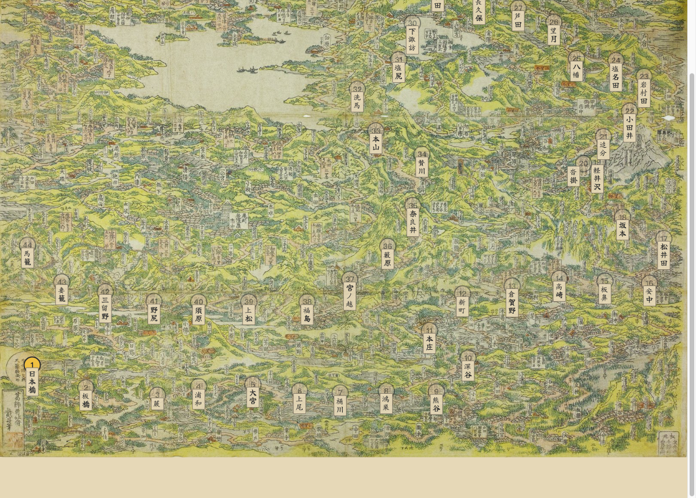
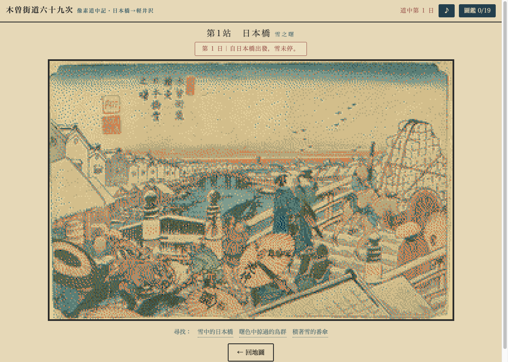

# Nakasendō Pixel — 中山道・木曽街道六十九次

[Tōkaidō Pixel](../tokaido-pixel) 的山線姊妹作。同一套公式：北斎鳥瞰圖當 overworld，每站進到浮世繪真跡裡找細節。

| | 東海道（本線） | 中山道（本作） |
|---|---|---|
| Overworld | 北斎《東海道名所一覧》1818 | 北斎《木曽路名所一覧》1819（翌年姊妹作） |
| 宿場系列 | 広重《東海道五十三次》保永堂版 | 渓斎英泉 24 + 広重 47 =《木曽海道六拾九次之内》71 幅 / 70 編號 |
| 站數 | 53+2 | 69+1 |
| 招牌事件 | 川止め（大川渡涉） | 峠越え・大雪（中山道當年正是為了避開渡河才被選走） |

版權：英泉歿 1848、広重歿 1858、北斎歿 1849 —— 全系列 public domain。

## 現況：素材 70/70 到齊，44 站可玩

兩個未驗證風險都拆掉了 →  **[完整報告](docs/phase0-asset-survey.md)**

- **Overworld**（第一風險）：北斎《木曽路名所一覧》**7898×5873** 可取得，比東海道的 overworld（2500px）還高。Commons 上沒有，唯一來源是神戸市立博物館的 IIIF（授權 CC BY-ND —— 原樣縮放使用合規，像素化不行；東海道的 overworld 本來就沒像素化，所以不受影響）。
- **宿場系列**：**70/70 全數到齊**。NDL 為主（~4470px），洗馬有 LOC 8991px；終點段的草津、大津 Commons 與 NDL 皆無，最後在波士頓美術館找到（2000px，剛好踩在 pipeline 地板上）。
- **可玩切片（日本橋 → 馬籠 44 站）**：素材全綠，每站 3 個隱藏細節逐張看圖標出。
- **繪師歸屬**：英泉 24 / 廣重 46（+ 中津川第二版）—— 與文獻公認的 24/47 吻合。

### 玩玩看

```bash
python3 -m http.server 8000   # 然後開 http://localhost:8000
```

| | |
|---|---|
|  |  |
| *北斎《木曽路名所一覧》當 overworld——江戶出發，翻過碓氷峠* | *開場：英泉〈日本橋 雪之曙〉。每站找三個藏在畫裡的細節* |

### Phase 1 進行中

- [x] overworld 的 IIIF tile 抓取器（[tools/fetch-overworld.py](tools/fetch-overworld.py)，7898×5873）
- [x] **色盤：單盤成立** —— 合併色盤 vs 各繪師本家色盤，平均額外誤差僅 +3%，
      不值得為此把場景與圖鑑分流成兩套（[報告](docs/palette-report.md)）
- [x] 〈洗馬〉月夜通過量化 pipeline —— 東海道沒驗過的光線 case
- [x] **引擎 fork 自 tokaido-pixel**，換上中山道的 overworld 與山線事件表
- [x] **道中事件分區**：關東平野／碓氷／信濃高地／木曾谷各有各的麻煩——峠越え不會在
      平原上發生，福島關所也不會在還沒進木曾谷時就查你的手形。東海道的招牌事件「川止め」
      在這裡幾乎不存在（中山道當年正是為了避開大川渡涉才被選走），只留給戸田川那一個渡口
- [x] **延伸切片：日本橋 → 馬籠（1–44 幅）** —— 從路的起點，翻過碓氷峠、和田峠，
      走完木曾谷十一宿。開場全是英泉的濃豔筆觸，廣重從第 12 幅才接手
- [x] overworld 節點座標：44 站有 41 站是讀圖上的地名卡片定出的，只有倉賀野・板鼻・下諏訪
      是內插（三站都夾在已驗證的鄰站之間）。那張圖是區域全景不是路線帶——同圖畫進了甲州街道
      與日光街道，「野田尻」是甲州的宿場不是木曾的「野尻」，只能逐張讀卡片
- [x] [`tools/check-details.py`](tools/check-details.py)：把細節座標畫回真跡上逐張核對。
      座標標錯不會報錯，只會讓玩家點不到東西——44 站首次全面核對就抓出 7 站標歪
- [ ] 45–70 幅（美濃・近江段）尚未撰寫細節與考據；素材已到齊

引擎 fork 自 tokaido-pixel（不是加「路線」維度——分析筆記原本這樣建議，實作時改為各自獨立一份）。分析全文見 vault `research/中山道-木曾街道六十九次-像素遊戲擴充分析.md`。

- [`data/stations.json`](data/stations.json) — 70 幅清單、繪師、掃描來源、MVP 標記
- [`tools/find-scans.py`](tools/find-scans.py) — 普查腳本（內含踩過的坑，別重踩）
- [`tools/plate.py`](tools/plate.py) — 自動偵測畫芯，去紙邊但保住題箋與朱印
- [`tools/make-palette.py`](tools/make-palette.py) — k-means 抽色 + 朱色保留槽
- [`tools/check-details.py`](tools/check-details.py) — 把細節座標畫回真跡，逐張核對點得到點不到
- [`tools/make-overworld.py`](tools/make-overworld.py) — 由 7898px 源檔產出 1600/3200 兩種寬度（srcset 按 DPR 挑）

## License

MIT（程式碼）。浮世繪掃描為 public domain，溯源記於 `assets/sources.json`。
