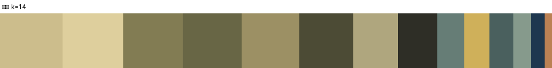
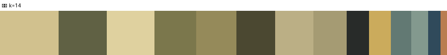
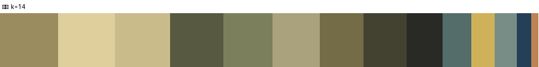

# 色盤：單盤 vs 雙盤（k=14）

樣本 68 幅（英泉 24 / 広重 44）。
指標：每幅在「合併色盤」下的量化 RMSE，比在「本家繪師色盤」下高出多少。

**合併色盤的平均額外誤差：+1.0%**

| # | 站 | 繪師 | 本家色盤 RMSE | 合併色盤 RMSE | 代價 |
|---|---|---|---|---|---|
| 38 | 福島 | 広重 | 16.80 | 18.52 | +10.2% |
| 19 | 軽井沢 | 広重 | 15.59 | 17.17 | +10.1% |
| 40 | 須原 | 広重 | 16.24 | 17.57 | +8.2% |
| 41 | 野尻 | 英泉 | 18.29 | 19.59 | +7.1% |
| 16 | 安中 | 広重 | 16.99 | 18.07 | +6.3% |
| 4 | 浦和 | 英泉 | 18.19 | 19.12 | +5.1% |
| 31 | 塩尻 | 英泉 | 17.22 | 18.07 | +4.9% |
| 12 | 新町 | 広重 | 19.62 | 20.58 | +4.9% |
| 59 | 関ケ原 | 広重 | 15.92 | 16.55 | +4.0% |
| 39 | 上松 | 広重 | 16.42 | 17.05 | +3.8% |
| 15 | 板鼻 | 英泉 | 14.82 | 15.35 | +3.6% |
| 60 | 今須 | 広重 | 18.61 | 19.21 | +3.2% |

（只列代價最高的 12 幅）

### 合併

`#decf9d` `#4c4b35` `#667d76` `#ccbd8c` `#9c9064` `#686645` `#afa67e` `#869a8c` `#1e374f` `#827c53` `#4a605e` `#cfb05a` `#2e2e26` `#bb8154`

### 英泉

`#627973` `#606144` `#d1c18e` `#83998e` `#cbab5c` `#958a5a` `#4b4831` `#282b29` `#a59b73` `#7b774c` `#dfd19f` `#bbaf85` `#304a5b` `#b97d51`

### 広重

`#556d6a` `#cabb8b` `#9b8c60` `#ceb158` `#434230` `#746b47` `#778d85` `#a9a27d` `#decf9d` `#7c7f5c` `#292a25` `#234057` `#575941` `#bd8356`
